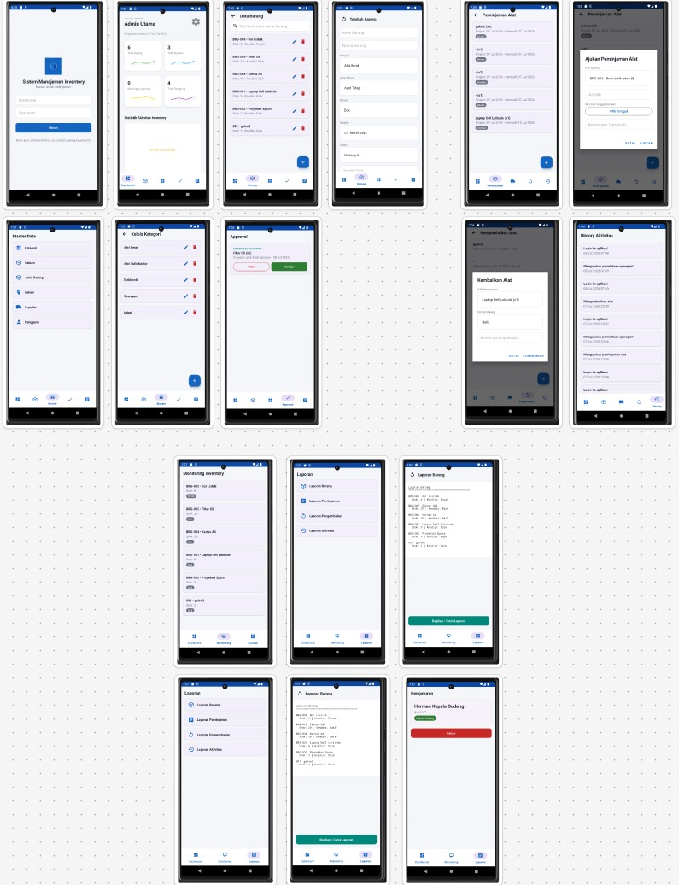

# 📦 Sistem Manajemen Inventory (Android Native - Kotlin)

<p align="center">
  
  
  
  
</p>

---

## 👥 Tim Pengembang (Kelompok 8)
Proyek ini dikembangkan oleh Kelompok 8 sebagai bagian dari tugas akhir mata kuliah **Pemrograman Mobile 1** (Semester 4) di **Universitas Teknologi Bandung**:

* **Daffa Ahmad Al-Fajri (24552011307)**
* **Gery Khoirul Ahmad Affandi (24552011377)**
* **M Dafa Dwi Saputra (24552011320)**

---

## 📋 Deskripsi Aplikasi
Aplikasi Android native ini dirancang untuk mengelola manajemen inventaris barang (*inventory*) dengan mendukung 3 peran pengguna terintegrasi: **Admin Inventory**, **PIC**, dan **Kepala Gudang**. 

Seluruh data operasional disimpan sepenuhnya secara lokal menggunakan **Room (SQLite)** sehingga aplikasi dapat berjalan 100% secara offline tanpa ketergantungan pada backend, API, maupun Firebase.

---

## 🎬 Link Video Demo & Dokumentasi UAS
* 🔗 **Link Video Demo Aplikasi (YouTube):** (https://youtu.be/Cw9O555B6ww?si=1nj8YR_Uian4Punu) *(Berisi perkenalan anggota kelompok, demo aplikasi, dan penjelasan alur kode)*
* 📁 **Berkas Laporan OOAD:** Tersimpan di dalam folder `/docs` pada repositori ini.
* 🤖 **Berkas APK Siap Pakai:** Tersimpan di dalam folder `/apk/app-release.apk`.

---

## 📸 Screenshot Tampilan Aplikasi
Berikut adalah beberapa dokumentasi antarmuka dari aplikasi Sistem Manajemen Inventory:

<p align="center">
  
</p>


---

## 🔐 Akun Demo (Seeding Data Otomatis)
Data master (kategori, satuan, supplier, lokasi, dan beberapa barang contoh) otomatis diisi saat database pertama kali dibuat lewat fungsi `AppDatabase.SeedCallback`. Berikut adalah akun demo yang dapat digunakan:

| Username | Password | Role / Hak Akses |
| :--- | :--- | :--- |
| **admin** | admin123 | Admin Inventory |
| **pic1** | pic123 | PIC (Person In Charge) |
| **pic2** | pic123 | PIC (Person In Charge) |
| **gudang1** | gudang123 | Kepala Gudang |

---

## ✨ Fitur Utama berdasarkan Role

### 👤 1. Admin Inventory
* **Dashboard:** Ringkasan statistik data barang dan aktivitas gudang.
* **Manajemen Data (CRUD):** Mengelola Data Barang dan Menu Master (Kategori, Satuan, Jenis Barang, Lokasi, Supplier, Pengguna).
* **Approval System:** Menyetujui atau menolak pengajuan peminjaman alat & permintaan sparepart.
* **Pelaporan:** Melihat dan mengekspor laporan Barang, Peminjaman, Pengembalian, serta Aktivitas dengan fitur Bagikan/Cetak.
* **Pengaturan:** Manajemen profil mandiri dan logout.

### 👤 2. PIC (Person In Charge)
* **Dashboard:** Ringkasan status pengajuan pribadi.
* **Peminjaman Alat:** Mengajukan peminjaman alat baru serta memantau status persetujuan.
* **Permintaan Sparepart:** Mengajukan permintaan sparepart pendukung operasional.
* **Pengembalian Alat:** Mengembalikan alat yang dipinjam dengan memilih kondisi akhir: *Baik*, *Rusak*, atau *Hilang*.
* **History:** Log rekam jejak aktivitas personal pengguna.

### 👤 3. Kepala Gudang
* **Dashboard:** Ringkasan kondisi gudang dan stok kritis.
* **Monitoring:** Memantau jumlah stok barang fisik dan kondisi kelayakan aset secara real-time.
* **Laporan:** Mengakses data laporan (Read-Only) yang sama dengan Admin serta mencetak dokumen laporan.

> 🔄 **Alur Logika Stok:** Saat peminjaman **disetujui** oleh Admin, stok barang akan berkurang secara otomatis. Ketika pengembalian dilakukan dengan kondisi **Baik**, stok akan bertambah kembali. Namun, jika kondisi akhir tercatat **Rusak/Hilang**, sistem otomatis memasukkannya ke tabel barang rusak/hilang tanpa mengembalikan jumlah stok utama.

---

## 🛠️ Arsitektur & Teknologi yang Digunakan

| Komponen | Teknologi |
| :--- | :--- |
| **Bahasa Pemrograman** | Kotlin |
| **UI Framework** | Material Design 3 (Modern Components) + ViewBinding |
| **Arsitektur Aplikasi** | MVVM (View → ViewModel → Repository → Room DAO) |
| **Navigasi Layar** | Navigation Component (1 Graph per Role: `nav_admin.xml`, `nav_pic.xml`, `nav_gudang.xml` dimuat dinamis) |
| **Persistensi Data** | Room Database (SQLite Lokal dengan 13 Entity terintegrasi) |
| **Sesi Login** | SharedPreferences (`SessionManager`) |
| **Asynchronous** | Kotlin Coroutines |
| **Minimum SDK** | API 31 (Android 12) |
| **Target SDK** | API 35 (Android 15) |

---

## 🗄️ 13 Entity Database Room (`inventory.db`)
Aplikasi ini melacak manajemen data yang kompleks secara lokal melalui 13 tabel entity berikut:
1. `Kategori` & 2. `Satuan` & 3. `Jenis Barang` (Klasifikasi Barang)
4. `Lokasi` (Penempatan Rak/Gudang)
5. `Supplier` (Pemasok Barang)
6. `User` (Data Akun & Role Sesi)
7. `Barang` (Stok Utama)
8. `Peminjaman` & 9. `Pengembalian` (Alur Distribusi Alat)
10. `Permintaan Sparepart` (Log Pengeluaran Komponen Habis Pakai)
11. `Barang Rusak` & 12. `Barang Hilang` (Pencatatan Depresiasi & Masalah Aset)
13. `Riwayat` (Log Kronologis Aktivitas Sistem)

---

## 📁 Struktur Folder Proyek
```text
app/src/main/java/com/utb/inventoryapp/
├── data/
│   ├── local/            ← Room Entity, DAO, AppDatabase + Seeding Data Dummy
│   └── repository/       ← InventoryRepository (Satu Facade/Pintu Akses Utama untuk Semua DAO)
├── session/              ← SessionManager (Pengelolaan Sesi Berbasis SharedPreferences)
├── ui/
│   ├── login/            ← LoginActivity & LoginViewModel
│   ├── main/             ← MainActivity (Host Fragment Utama yang Memuat NavGraph secara Dinamis)
│   ├── admin/            ← Fragment & ViewModel Sisi Admin (Dashboard, Barang, Master, Approval, Laporan)
│   ├── pic/              ← Fragment & ViewModel Sisi PIC (Peminjaman, Sparepart, Pengembalian, History)
│   ├── gudang/           ← Fragment Sisi Kepala Gudang (Dashboard, Monitoring Stok)
│   └── common/           ← Komponen Reusable (GenericListAdapter, SimpleMasterFragment, PengaturanFragment)
└── util/                 ← Extension Functions & ViewModel Factory Custom
```
🚀 Cara Menjalankan Aplikasi
1. Ekstrak Berkas ZIP proyek ini, lalu buka direktori utamanya secara langsung
melalui IDE Android Studio Panda 2025.3.1 Patch 1 (File > Open).
2. Biarkan Android Studio mendeteksi konfigurasi Gradle proyek. Tunggu hingga
proses Gradle Sync selesai sepenuhnya.
3. Hubungkan perangkat HP fisik (pastikan opsi USB Debugging aktif) atau gunakan
Emulator dengan Android 12 (API 31) atau versi di atasnya.
4. Klik tombol Run (▶️) pada toolbar Android Studio.
5. Gunakan salah satu akun dari tabel Akun Demo untuk menguji alur fitur
masing-masing role.

⚠️ Batasan Sistem

● Gradle Wrapper Configuration: File biner .jar dari Gradle Wrapper (gradlew) sengaja
tidak dimasukkan ke dalam repositori ini demi keamanan environment. Saat
pertama kali dibuka di Android Studio lokal Anda, terima tawaran otomatis dari IDE
untuk men-generate kembali wrapper-nya. Berkas konfigurasi
gradle-wrapper.properties sudah diarahkan untuk mengonsumsi Gradle 8.9.

● Android Gradle Plugin (AGP) 8.7.3: Proyek ini menggunakan AGP versi 8.7.3 yang
stabil guna menghindari konflik "built-in Kotlin" pada AGP 9.0 bawaan Android
Studio Panda yang kerap memicu error Cannot add extension with name 'kotlin'.
Jika muncul notifikasi rekomendasi pembaruan AGP dari Android Studio, silakan
abaikan/tolak.

● Versi Dependensi: Jika proses Gradle Sync mendeteksi dependensi yang usang,
Anda dipersilakan menaikkan versi komponen AndroidX/Room ke rilis stabil
terbaru melalui berkas app/build.gradle.kts.
